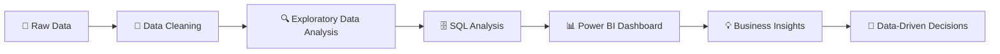

# 👋 Hi, I'm Abhinay Sah

### 📊 Data Analyst | 🤖 Aspiring Data Scientist | 🐍 Python | 🗄️ SQL | 📈 Power BI

> **Turning messy data into meaningful insights, interactive dashboards, and practical machine-learning solutions. 🚀**

---

## 🚀 About Me

🎯 I'm a **Data Analytics & Data Science enthusiast** focused on solving real-world business problems with data.

* 🔭 Currently working on **Data Analytics, ML & Data Science projects**
* 📊 Building projects using **Python, SQL, Excel & Power BI**
* 🤖 Exploring **Machine Learning & predictive analytics**
* 🧠 Strengthening **Statistics, Advanced SQL & Data Science**
* 🧹 Passionate about **Data Cleaning, EDA & finding hidden patterns**
* 💡 Interested in **real-world business problems and data-driven decision making**
* 🤝 Open to collaborating on **Data Analytics, Data Science & ML projects**
* 💬 Ask me about **Python, SQL, Excel, Power BI, EDA & Data Visualization**
* ⚡ Fun fact: I enjoy transforming **messy datasets → insights → dashboards → predictions** 🚀📊

---

## 🧰 Tech Stack

### 📊 Data Analytics


### 🐍 Python & Data Science


### 🤖 Machine Learning


### 🛠️ Tools & Workflow


---

## 📈 What I Work With

```text
Data Cleaning        ████████████████████  100%
Exploratory Analysis ███████████████████░   95%
SQL                  ███████████████████░   95%
Power BI             ██████████████████░░   90%
Excel                ██████████████████░░   90%
Python               ██████████████████░░   90%
Machine Learning     ████████████████░░░░   80%
Statistics           ███████████████░░░░░   75%
```

---

## 🔥 Featured Projects

### 🛒 E-Commerce Sales & Business Analytics

**Tools:** `Excel` `Power Query` `SQL` `Python` `Power BI`

📌 An end-to-end business analytics project focused on understanding:

* 💰 Sales & profit performance
* 👥 Customer behavior
* 🛍️ Product & category performance
* 📉 Discount vs profitability
* 🚚 Delivery & operational performance
* 🌎 State-wise business performance

**Workflow:**

`Raw Data → Power Query → Python EDA → SQL Analysis → Power BI Dashboard → Business Insights`

---

### 🚗 Road Accident Analysis & Safety Insights

**Tools:** `Excel` `SQL` `Power BI`

📌 Analyzing **300K+ road accident records** to identify:

* 🚨 Accident & casualty trends
* 🌧️ Weather and road-condition impact
* 🛣️ Road-condition patterns
* 📍 Location-based accident trends
* 📊 High-risk areas
* 💡 Data-driven safety insights

---

### 🤖 Customer Churn Prediction System

**Tools:** `Python` `Pandas` `Scikit-Learn` `Streamlit`

📌 Machine-learning application designed to predict customers who are likely to churn.

**Techniques:**

`Data Cleaning → EDA → Feature Engineering → ML Models → Evaluation → Prediction → Streamlit`

---

### 📚 DocuMind AI — Multi-PDF RAG Chatbot

**Tools:** `Python` `LangChain` `FAISS` `Hugging Face` `Groq` `Streamlit`

📌 AI-powered document question-answering system using **Retrieval-Augmented Generation (RAG)**.

**Pipeline:**

`PDF → Text Extraction → Chunking → Embeddings → FAISS → Retrieval → LLM → Answer`

---

## 🧠 My Data Analytics Workflow



---

## 📊 GitHub Statistics

<div align="center">


<br/>


<br/>


</div>

---

## 🌐 Let's Connect

<div align="center">

<a href="https://linkedin.com/in/abhinay-sah-555b0b291">

</a>

<a href="https://instagram.com/scitech_2301">

</a>

<a href="mailto:abhinaysah31@gmail.com">

</a>

</div>

---

## 🎯 Currently Learning

```text
📊 Advanced Data Analytics
🗄️ Advanced SQL
📈 Power BI & DAX
🐍 Advanced Python for Data Analysis
📐 Statistics for Data Science
🤖 Machine Learning
🧠 Generative AI & RAG
🔗 LangChain & LangGraph
```

---

## 💭 My Data Philosophy

> **"Good data analysis isn't just about finding numbers —
> it's about understanding what those numbers mean for the business."**

---

<div align="center">

### 🚀 From Data → Insights → Decisions

**Thanks for visiting my profile! ⭐**


</div>
